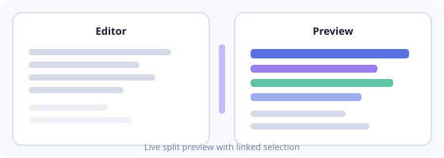
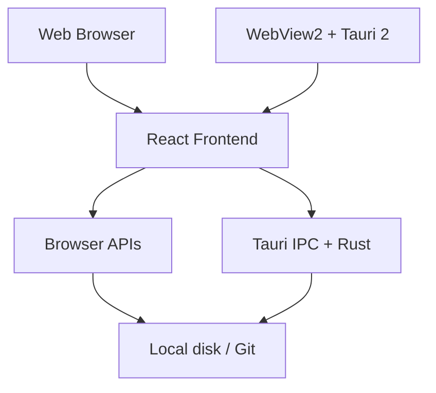
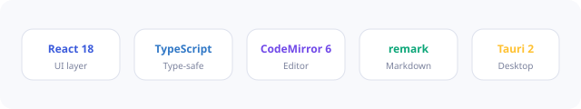

<p align="center">
  
</p>

<p align="center">
  <strong>A sleek, distraction-free Markdown editor</strong><br/>
  Live preview · Workspace tools · Export · Built with Tauri 2 + React
</p>

<p align="center">
  <a href="LICENSE"></a>
  <a href="https://www.rust-lang.org/"></a>
  <a href="https://react.dev/"></a>
  <a href="https://www.typescriptlang.org/"></a>
  
</p>

<p align="center">
  <a href="#features">Features</a> ·
  <a href="docs/">Documentation</a> ·
  <a href="#quick-start">Quick start</a> ·
  <a href="#web-vs-desktop">Web vs desktop</a> ·
  <a href="#contributing">Contributing</a>
</p>

---

<p align="center">
  
</p>

<p align="center"><em>Write on the left, preview on the right — with linked selection and scroll sync.</em></p>

---

## About

**MDit** is a fast, local-first Markdown editor for writers, developers, and document authors. It combines a CodeMirror-powered writing surface with a rich live preview (GFM, KaTeX, Mermaid, SVG) and professional export options.

Available as a **native desktop app** (Windows) and a **web build** for quick access in the browser.

> Built by [Omar S. M. Abdelfatah](https://omarsharaf.me)

---

## Features

<table>
<tr>
<td width="50%">

### Writing & preview
- Live **split preview** with GFM
- **KaTeX** math & **Mermaid** diagrams
- **Wiki links** (`[[page]]`) in workspace
- Slash commands, Markdown lint, **Vim** keymap
- YAML front matter & document outline
- Presentation slide mode

</td>
<td width="50%">

### Workspace *(desktop)*
- Open **project folders** with file tree
- **Workspace search** across all `.md` files
- **Git status** panel for changed files
- **GitHub import** — file, Gist, or repo
- Snapshots, pinned tabs, split editor

</td>
</tr>
<tr>
<td>

### Export
- Self-contained **HTML**
- **Word** (`.doc`) & **ODT**
- Print / **PDF**
- Publish workspace as static site
- Custom preview CSS

</td>
<td>

### Productivity
- Command palette & templates
- Customizable keyboard shortcuts
- Auto-save & session restore
- Focus mode, light/dark theme
- High contrast & reduced motion

</td>
</tr>
</table>

---

## Architecture



<p align="center">
  
</p>

Both targets share one **React frontend**. The web build runs in the browser with limited file APIs; the desktop build hosts the same UI in **WebView2** and calls **Rust commands** via Tauri for folders, Git, search, and native dialogs.

<p align="center">
  
</p>

| Layer | Technology |
| --- | --- |
| UI | React 18, TypeScript, Zustand |
| Editor | CodeMirror 6 |
| Preview | remark, rehype, KaTeX, Mermaid |
| Desktop | Tauri 2, Rust, WebView2 |

---

## Web vs desktop

| Capability | Web | Desktop |
| --- | :---: | :---: |
| Edit & preview markdown | ✅ | ✅ |
| Open single files | ✅ | ✅ |
| GitHub URL import | ✅ | ✅ |
| Open folder / file tree | ❌ | ✅ |
| Workspace search | ❌ | ✅ |
| Git panel | ❌ | ✅ |
| File associations (`.md`) | ❌ | ✅ |

→ Full comparison: [docs/getting-started/web-vs-desktop.md](docs/getting-started/web-vs-desktop.md)

---

## Quick start

### Prerequisites

- [Node.js](https://nodejs.org/) 18+
- [Rust](https://www.rust-lang.org/tools/install) + [VS Build Tools](https://visualstudio.microsoft.com/visual-cpp-build-tools/) *(desktop only)*

### Install & run

```bash
git clone https://github.com/OmarSharaf/MDit.git
cd MDit
npm install
```

**Web (development):**

```bash
npm run dev
# → http://localhost:1420
```

**Desktop (development):**

```bash
npm run tauri dev
```

**Production builds:**

```bash
npm run build          # web → dist/
npm run tauri build    # desktop → src-tauri/target/release/bundle/
```

→ Detailed guide: [docs/development/setup.md](docs/development/setup.md)

---

## Documentation

Full documentation lives in the [`docs/`](docs/) folder.

| Section | Description |
| --- | --- |
| [📖 Documentation index](docs/README.md) | Start here |
| [Getting started](docs/getting-started/installation.md) | Install, quick start, web vs desktop |
| [User guide](docs/user-guide/interface.md) | Interface, writing, workspace, export, settings |
| [Reference](docs/reference/keyboard-shortcuts.md) | Shortcuts & command palette |
| [Development](docs/development/setup.md) | Setup, structure, building releases |
| [Contributing](docs/contributing.md) | How to contribute |

---

## Keyboard shortcuts

| Action | Shortcut |
| --- | --- |
| New file | `Ctrl+N` |
| Open file | `Ctrl+O` |
| Save | `Ctrl+S` |
| Command palette | `Ctrl+Shift+P` |
| Workspace search | `Ctrl+Shift+F` *(desktop)* |
| Snapshots | `Ctrl+Shift+K` |
| Toggle sidebar | `Ctrl+\` |
| Focus mode | `F11` |

→ Full list: [docs/reference/keyboard-shortcuts.md](docs/reference/keyboard-shortcuts.md)

---

## Project structure

```
MDit/
├── docs/              # Documentation & SVG assets
├── src/               # React frontend
├── src-tauri/         # Tauri / Rust backend
├── README.md
└── LICENSE
```

→ Details: [docs/development/project-structure.md](docs/development/project-structure.md)

---

## Contributing

Contributions are welcome! Please read [docs/contributing.md](docs/contributing.md) before opening a pull request.

1. Fork the repo
2. Create a feature branch
3. Make your changes and test (`npm run build`)
4. Open a pull request

---

## License

This project is licensed under the [MIT License](LICENSE).

---

<p align="center">
  
  <br/><br/>
  <strong>MDit</strong> · Markdown, done well.<br/>
  <a href="https://omarsharaf.me">omarsharaf.me</a>
</p>
