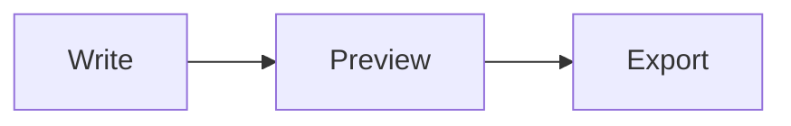

# Quick start

Get productive with MDit in a few minutes.

<p align="center">
  
</p>

---

## 1. Open MDit

- **Desktop:** Launch MDit from the Start menu or taskbar.
- **Web:** Open the hosted URL or run `npm run dev` locally.

Built-in tabs **welcome.md** and **features-guide.md** open automatically.

---

## 2. Choose a view mode

Use the title bar to switch modes:

| Mode | Use when |
| --- | --- |
| **Edit** | Focused writing |
| **Split** | Writing with live preview *(recommended)* |
| **Preview** | Reading finished output |
| **Present** | Slide-style presentations |

---

## 3. Create or open a document

| Action | Shortcut |
| --- | --- |
| New file | `Ctrl+N` |
| Open file | `Ctrl+O` |
| Save | `Ctrl+S` |
| Command palette | `Ctrl+Shift+P` |

On **desktop**, click **Open folder** in the sidebar to load a project tree, search, and Git status.

---

## 4. Write with live preview

Try these in the editor — they render instantly in the preview pane:

```markdown
# Hello MDit

**Bold**, *italic*, and `code`.

- [x] Task list
- [ ] Another item

| Feature | Status |
| --- | --- |
| GFM tables | ✅ |

Inline math: $E = mc^2$


```

Select text in either pane — the other pane highlights the matching content when **Link selection** is enabled in Settings.

---

## 5. Organize with the sidebar

| Section | What it does |
| --- | --- |
| **Outline** | Jump to headings in the active document |
| **Open Files** | Switch between tabs |
| **Recent files** | Reopen recently edited documents |

**Desktop only:** Files tree, workspace search (`Ctrl+Shift+F`), Git panel.

---

## 6. Export your work

Use the toolbar **Export** menu or `Ctrl+Shift+P` → *Export as HTML*:

- HTML (self-contained)
- Markdown / plain text
- Word (`.doc`) / ODT
- Print / PDF
- Copy rendered HTML or Markdown

---

## 7. Customize

Open **Settings** (gear icon) to adjust:

- Light / dark theme and preview style
- Font size, line wrap, Vim keymap
- Auto-save delay and session restore
- Keyboard shortcuts

---

## What's next?

| Topic | Guide |
| --- | --- |
| Full feature list | [Features overview](../user-guide/features-overview.md) |
| Workspace & Git | [Workspace & files](../user-guide/workspace.md) |
| All shortcuts | [Keyboard shortcuts](../reference/keyboard-shortcuts.md) |

---

*Happy writing.*
