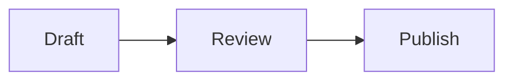

# Writing & formatting

MDit supports standard Markdown, GitHub Flavored Markdown (GFM), and rich extensions for technical writing.

---

## Basic formatting

| Syntax | Result |
| --- | --- |
| `**bold**` | **bold** |
| `*italic*` | *italic* |
| `~~strike~~` | ~~strike~~ |
| `` `code` `` | inline code |
| `# Heading` | Heading levels H1–H6 |
| `> quote` | Blockquote |
| `- item` | Bullet list |
| `1. item` | Numbered list |
| `- [x] done` | Task list |

### Toolbar shortcuts

| Shortcut | Action |
| --- | --- |
| `Ctrl+B` | Bold |
| `Ctrl+I` | Italic |
| `Ctrl+K` | Insert link |

---

## Tables

```markdown
| Column A | Column B |
| --- | --- |
| One | Two |
```

Use the toolbar **Table** button to insert a table with a chosen row/column count.

---

## Code blocks

````markdown
```javascript
function greet(name) {
  return `Hello, ${name}!`;
}
```
````

Syntax highlighting is applied automatically based on the language tag.

---

## Math (KaTeX)

Inline: `$E = mc^2$`

Display:

```markdown
$$
\int_0^1 x^2 \, dx = \frac{1}{3}
$$
```

---

## Mermaid diagrams

````markdown

````

Supported diagram types include flowchart, sequence, state, Gantt, pie, and more.

---

## Inline SVG

Paste SVG directly into your document — it renders in preview when sanitized HTML is allowed.

---

## Slash commands

Type `/` at the **start of a line** to open the insert menu:

- Headings (H1–H3)
- Table, code block, Mermaid block
- Blockquote, task list, front matter
- Wiki link snippet, slide break (`---`)

Use **↑/↓** and **Enter** to select.

---

## Markdown lint

Enable **Markdown lint warnings** in Settings. The editor underlines:

- Trailing whitespace
- Skipped heading levels (e.g. H1 → H3)
- Images missing alt text
- Tab-indented list items

---

## Editor keymaps

Settings → **Editor keymap**:

| Mode | Description |
| --- | --- |
| Default | Standard editing |
| Vim | Vim-style modal editing |
| Emacs | Emacs-style bindings |

---

## Presentation slides

1. Switch to **Presentation** view
2. Separate slides with a horizontal rule on its own line: `---`
3. Navigate with **← / →**, **Space**, **Home**, **End**

---

## Link selection & scroll sync

| Setting | Effect |
| --- | --- |
| **Link selection** | Selecting text in one pane highlights matching content in the other |
| **Link scroll position** | Keeps editor and preview scrolled to the same ratio |

Both are under Settings → Writing.

---

## Related

- [Export & publish](export.md)
- [Features overview](features-overview.md)
